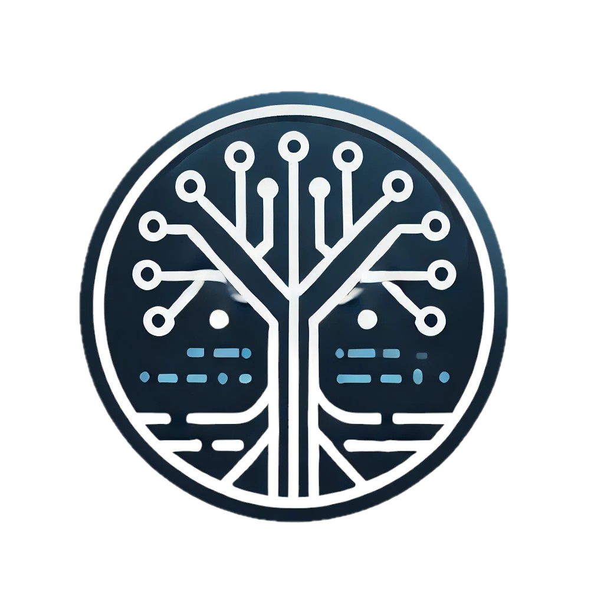

<p>
<div align="center">
  
</p>


[](https://github.com/shivasurya/code-pathfinder/actions/workflows/build.yml)
[](https://marketplace.visualstudio.com/items?itemName=codepathfinder.secureflow)
[](https://www.npmjs.com/package/@codepathfinder/secureflow-cli)
[](https://open-vsx.org/extension/codepathfinder/secureflow)
[](https://github.com/shivasurya/code-pathfinder/blob/main/LICENSE)
[](https://deepwiki.com/shivasurya/code-pathfinder)
</div>

# Code Pathfinder 

**An open-source security suite aiming to combine structural code analysis with AI-powered vulnerability detection.**

Code Pathfinder is designed to bridge the gap between traditional static analysis tools and modern AI-assisted security review. While mature tools excel at pattern matching and complex queries, Code Pathfinder focuses on making security analysis more accessible, leveraging large language models to understand context and identify nuanced vulnerabilities, and integrated throughout the development lifecycle.

- **Real-time IDE integration** - Bringing security insights directly into your editor as you code
- **AI-assisted analysis** - Leveraging large language models to understand context and identify nuanced vulnerabilities
- **Unified workflow coverage** - From local development to pull requests to CI/CD pipelines
- **Flexible reporting** - Supporting DefectDojo, GitHub Advanced Security, SARIF, and other platforms

Built for security engineers and developers who want an extensible, open-source alternative that's evolving with modern development practices. Here are the initiatives:

- **[Code-Pathfinder CLI](https://github.com/shivasurya/code-pathfinder/releases)** - Basic security analysis scanner better than grep
- **[Secureflow CLI](https://github.com/shivasurya/code-pathfinder/tree/main/extension/secureflow/packages/secureflow-cli)** - Claude-Code for security analysis powered by large language models with better context engineering
- **[Secureflow VSCode Extension](https://github.com/shivasurya/code-pathfinder/tree/main/extension/secureflow)** - IDE integration for security analysis powered by large language models with better context engineering

## :tv: Demo

### Secureflow CLI

```bash
$ secureflow scan ./path/to/project
```

### Code-Pathfinder CLI

```bash
docker run --rm -v "./src:/src" shivasurya/code-pathfinder:stable-latest ci --project /src/your-project --ruleset cpf/java
```

## :book: Documentation

- [Documentation](https://codepathfinder.dev/)
- [Pathfinder Queries](https://github.com/shivasurya/code-pathfinder/tree/main/pathfinder-rules)


## :floppy_disk: Installation

### :whale: Using Docker

```bash
$ docker pull shivasurya/code-pathfinder:stable-latest
```

### From npm

#### Secureflow CLI

```bash
$ npm install -g @codepathfinder/secureflow-cli
$ secureflow scan --help
```

#### Code-Pathfinder CLI

```bash
$ npm install -g codepathfinder
$ pathfinder --help
```

### Pre-Built Binaries

Download the latest release from [GitHub releases](https://github.com/shivasurya/code-pathfinder/releases) and choose
the binary that matches your operating system.

```shell
$ chmod u+x pathfinder
$ pathfinder --help
```


## Getting Started
Read the [official documentation](https://codepathfinder.dev/), or run `pathfinder --help`.

## Features

- [x] Graph-based structural queries
- [x] Source Sink Analysis
- [ ] Data Flow Analysis with Control Flow Graph

## Usage

### Scan Command (Interactive)

```bash
# Basic scan
pathfinder scan --rules rules/ --project /path/to/project

# With verbose output
pathfinder scan --rules rules/ --project . --verbose

# With debug output
pathfinder scan --rules rules/ --project . --debug

# Fail on specific severities
pathfinder scan --rules rules/ --project . --fail-on=critical,high
```

### CI Command (Machine-Readable)

```bash
# JSON output
pathfinder ci --rules rules/ --project . --output json > results.json

# CSV output
pathfinder ci --rules rules/ --project . --output csv > results.csv

# SARIF output (GitHub Code Scanning)
pathfinder ci --rules rules/ --project . --output sarif > results.sarif

# With failure control
pathfinder ci --rules rules/ --project . --output json --fail-on=critical
```

## Output Formats

### Text Output (Default for scan)

```
Code Pathfinder Security Scan

Results:

Critical Issues (1):

  [critical] [Taint-Local] command-injection: Command Injection
    CWE-78 | A1:2017

    auth/login.py:127
      > 125 |     user_input = request.form['username']
        126 |     # Process input
      > 127 |     os.system(f"echo {user_input}")

    Flow: user_input (line 125) -> os.system (line 127)
    Confidence: High | Detection: Intra-procedural taint analysis

Summary:
  1 findings across 10 rules
  1 critical
```

### JSON Output

```json
{
  "tool": {
    "name": "Code Pathfinder",
    "version": "0.0.25"
  },
  "scan": {
    "target": "/path/to/project",
    "rules_executed": 10
  },
  "results": [
    {
      "rule_id": "command-injection",
      "severity": "critical",
      "location": {
        "file": "auth/login.py",
        "line": 127
      },
      "detection": {
        "type": "taint-local",
        "source": {"line": 125, "variable": "user_input"},
        "sink": {"line": 127, "call": "os.system"}
      }
    }
  ],
  "summary": {
    "total": 1,
    "by_severity": {"critical": 1}
  }
}
```

### CSV Output

```csv
severity,confidence,rule_id,rule_name,cwe,owasp,file,line,column,function,message,detection_type,detection_scope,source_line,sink_line,tainted_var,sink_call
critical,high,command-injection,Command Injection,CWE-78,A1:2017,auth/login.py,127,8,login,User input flows to shell,taint-local,local,125,127,user_input,os.system
```

### SARIF Output

SARIF 2.1.0 compatible output for GitHub Code Scanning integration.

```bash
# Upload to GitHub Code Scanning
gh api /repos/:owner/:repo/code-scanning/sarifs -F sarif=@results.sarif
```

## Verbosity Levels

| Flag | Output |
|------|--------|
| (default) | Clean results only |
| `--verbose` | Results + progress + statistics |
| `--debug` | All output + timestamps |

## Exit Codes

| Code | Meaning |
|------|---------|
| 0 | Success (no findings, or findings without --fail-on match) |
| 1 | Findings match --fail-on severities |
| 2 | Configuration or execution error |

### Examples

```bash
# Default: always exit 0
pathfinder scan --rules rules/ --project .
echo $?  # 0 even with findings

# Fail on critical or high
pathfinder scan --rules rules/ --project . --fail-on=critical,high
echo $?  # 1 if critical/high found, 0 otherwise

# Fail on any finding
pathfinder scan --rules rules/ --project . --fail-on=critical,high,medium,low
```

## Acknowledgements
Code Pathfinder uses tree-sitter for all language parsers.

