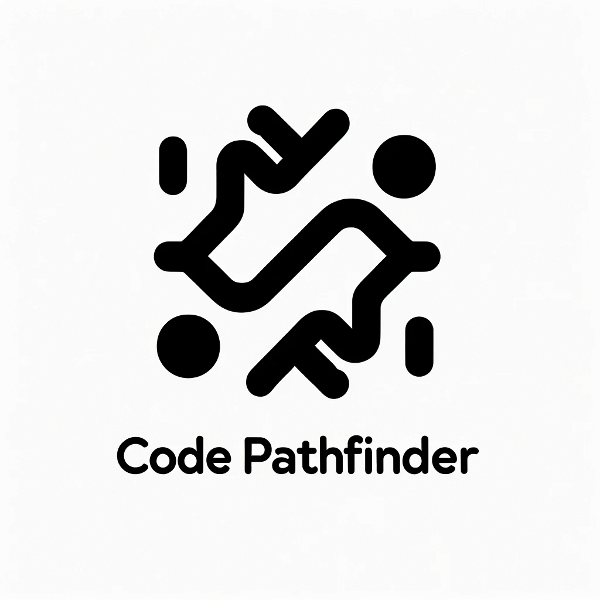

<div align="center">
  
</p>

# Code-Pathfinder
Code Pathfinder is an attempt to build real-time querying system that can perform source sink analysis, taint analysis on source code. It's work in progress and currently supports only Java.

</div>

## Features

- [x] Source Sink Analysis
- [ ] Taint Analysis
- [ ] Data Flow Analysis with Control Flow Graph

## Usage

Currently docker compose is used to run the application. Add the source code to be analyzed in the `sourcecode-parser/example-java-project` directory. The application will automatically detect the source code and start the analysis.

```bash
$ cd sourcecode-parser

$ docker compose up -d
```

Visit `http://localhost:8080` to access the application.