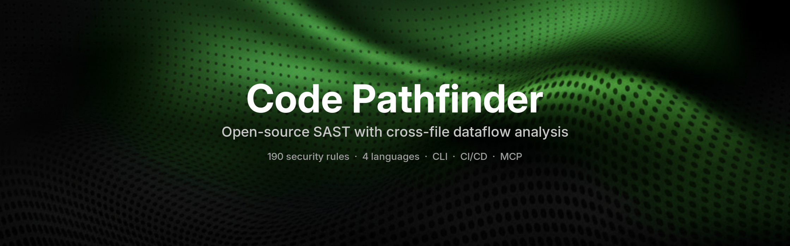

<div align="center">
  
</div>

<div align="center">

[Website](https://codepathfinder.dev/) • [Installation](https://codepathfinder.dev/docs/quickstart) • [Rule Registry](https://codepathfinder.dev/registry) • [How to write rule?](https://codepathfinder.dev/docs/rules) • [VS Code](https://marketplace.visualstudio.com/items?itemName=codepathfinder.secureflow) • [Open VSX](https://open-vsx.org/extension/codepathfinder/secureflow)

[](https://github.com/shivasurya/code-pathfinder/actions/workflows/build.yml)
[](https://marketplace.visualstudio.com/items?itemName=codepathfinder.secureflow)
[](https://open-vsx.org/extension/codepathfinder/secureflow)
[](https://github.com/shivasurya/code-pathfinder/blob/main/LICENSE)
[](https://deepwiki.com/shivasurya/code-pathfinder)

</div>

# [Code Pathfinder](https://codepathfinder.dev)

With AI tools generating thousands of lines of code in seconds, the bottleneck has shifted from writing code to reviewing and securing it at scale. Traditional static analysis tools struggle with modern AI-generated codebases that mix languages, frameworks, and infrastructure-as-code in the same repository.

Code Pathfinder flips this model. Instead of brittle regex or AST pattern matching per language, it indexes your entire codebase as structured, queryable data (AST, CFG, DFG). Write language-agnostic queries that trace data flows across Python, [Dockerfiles](https://codepathfinder.dev/registry), and [docker-compose](https://codepathfinder.dev/blog/announcing-docker-compose-security-rules) in a single rule—critical for CVE detection and vulnerability research when you need to understand how dependencies are used, what privileges they run with, and what attack surface they expose.

## What it is

- **[Open-source SAST](https://codepathfinder.dev)** that combines structural analysis (call graphs, dataflow, taint tracking) with AI to [understand real exploit paths](https://codepathfinder.dev/blog/static-analysis-isnt-enough-understanding-library-interactions-for-effective-data-flow-tracking), not just regex hits.
- **AI-powered vulnerability hunting** via [SecureFlow](https://codepathfinder.dev/secureflow-ai), which layers 10+ models (Claude, GPT, Gemini, Grok, Ollama, etc.) on top of deterministic analysis for [context-aware triage](https://codepathfinder.dev/blog/introducing-secureflow-cli-to-hunt-vuln).
- **Developer-first workflow** with [IDE integration](https://codepathfinder.dev/docs/quickstart), CLI, and CI support so security checks land where code is written and reviewed.

## Why it's different

- **Graph-first engine**: builds a rich representation of [functions, endpoints, DB calls, and dataflows](https://codepathfinder.dev/blog/static-analysis-isnt-enough-understanding-library-interactions-for-effective-data-flow-tracking) to cut false positives and surface real source‑to‑sink issues.
- **LLM as validator, not oracle**: uses models to [explain, prioritize, and validate findings](https://github.blog/ai-and-ml/llms/how-ai-enhances-static-application-security-testing-sast/) after structural analysis, keeping behavior predictable and reproducible.
- **Privacy‑first, BYOK**: your code stays local; you [bring your own keys](https://codepathfinder.dev/secureflow-ai) and talk directly to providers with no vendor-side code ingestion.

## Where it fits in your stack

- **Local & IDE**: SecureFlow VS Code extension ([VS Code Marketplace](https://marketplace.visualstudio.com/items?itemName=codepathfinder.secureflow) | [Open VSX](https://open-vsx.org/extension/codepathfinder/secureflow)) for real‑time security feedback as you type.
- **CLI & agents**: [SecureFlow CLI](https://www.npmjs.com/package/@codepathfinder/secureflow-cli) runs agentic loops over your repo (profile, read, trace, validate) to hunt vulnerabilities with the same ergonomics as modern AI coding tools.
- **Pipelines & reporting**: integrates into CI/CD and exports to formats and systems like SARIF, [GitHub Advanced Security](https://github.com/shivasurya/code-pathfinder), and DefectDojo so findings flow into existing governance.

## Project components

- **[Code Pathfinder CLI](https://codepathfinder.dev/blog/codeql-oss-alternative)** – structural security scanner and query engine for code graphs, better than grep/AST‑only search for paths and patterns.
- **[SecureFlow CLI](https://www.npmjs.com/package/@codepathfinder/secureflow-cli)** – AI‑powered vulnerability hunter that uses agent loops and 10+ models for deep, context‑aware scans across real projects.
- **SecureFlow VS Code extension** ([VS Code Marketplace](https://marketplace.visualstudio.com/items?itemName=codepathfinder.secureflow) | [Open VSX](https://open-vsx.org/extension/codepathfinder/secureflow)) – in‑editor experience for running scans, reviewing traces, and getting AI‑validated security insights without leaving your workspace.
- **[Custom Rules](https://codepathfinder.dev/docs/rules)** – write your own security rules using the PathFinder query language to detect project-specific vulnerabilities and patterns.

## Supported Languages

- **[Python](https://codepathfinder.dev/registry/python)** – Full support for security analysis and vulnerability detection
- **[Docker](https://codepathfinder.dev/registry/docker)** – Dockerfile security scanning
- **[Docker Compose](https://codepathfinder.dev/registry/docker-compose)** – Configuration analysis and security checks
- **Go** – Coming soon

## Installation

### Homebrew (Recommended)

The easiest way to install on macOS or Linux. Available from version 0.0.34 onwards.

```bash
brew install shivasurya/tap/pathfinder
```

### pip

Install via pip to get **both** the CLI binary and Python DSL for writing security rules.

```bash
pip install codepathfinder
```

**Verify installation:**

```bash
# Test CLI binary
pathfinder --version

# Test Python DSL
python -c "from codepathfinder import rule, calls; print('DSL OK')"
```

**Supported platforms:** Linux (x86_64, aarch64), macOS (Intel, Apple Silicon), Windows (x64)

> **Migrating from npm?** The npm package is deprecated. Run `npm uninstall -g codepathfinder` then `pip install codepathfinder`.

### Docker

Ideal for CI/CD pipelines and containerized workflows.

```bash
docker pull shivasurya/code-pathfinder:stable-latest

# Run a scan
docker run --rm -v "./src:/src" \
  shivasurya/code-pathfinder:stable-latest \
  scan --project /src --rules /src/rules
```

### Pre-Built Binaries

Download platform-specific binaries from [GitHub Releases](https://github.com/shivasurya/code-pathfinder/releases). Available for Linux (amd64, arm64), macOS (Intel, Apple Silicon), and Windows (x64).

```bash
chmod u+x pathfinder
./pathfinder --help
```

### From Source

Build from source for the latest features. Requires Gradle and Go.

```bash
git clone https://github.com/shivasurya/code-pathfinder
cd code-pathfinder/sast-engine
gradle buildGo
./build/go/pathfinder --help
```


## Usage

### Scan Command (Interactive)

```bash
# Basic scan (text output to console)
pathfinder scan --rules rules/ --project /path/to/project

# With verbose output
pathfinder scan --rules rules/ --project . --verbose

# With debug output
pathfinder scan --rules rules/ --project . --debug

# JSON output to file
pathfinder scan --rules rules/ --project . --output json --output-file results.json

# SARIF output to file (GitHub Code Scanning compatible)
pathfinder scan --rules rules/ --project . --output sarif --output-file results.sarif

# CSV output to file
pathfinder scan --rules rules/ --project . --output csv --output-file results.csv

# JSON output to stdout (for piping)
pathfinder scan --rules rules/ --project . --output json | jq .

# Fail on specific severities
pathfinder scan --rules rules/ --project . --fail-on=critical,high
```

## GitHub Action

Add security scanning to your CI/CD pipeline in just a few lines.

**Best Practice:** Pin to a specific version (e.g., `@v1.2.0`) for stability and reproducibility. Using `@main` will always pull the latest changes, which may introduce breaking changes.

```yaml
# .github/workflows/security-scan.yml
name: Security Scan

on: [push, pull_request]

permissions:
  security-events: write
  contents: read

jobs:
  scan:
    runs-on: ubuntu-latest
    steps:
      - uses: actions/checkout@v6

      # Scan with remote Python rulesets
      - name: Run Python Security Scan
        uses: shivasurya/code-pathfinder@v1.2.0
        with:
          ruleset: python/deserialization, python/django, python/flask
          fail-on: critical,high

      - name: Upload SARIF
        uses: github/codeql-action/upload-sarif@v4
        if: always()
        with:
          sarif_file: pathfinder-results.sarif
```

**Scan Dockerfiles:**
```yaml
      - name: Run Docker Security Scan
        uses: shivasurya/code-pathfinder@v1.2.0
        with:
          ruleset: docker/security, docker/best-practice
```

**Use local rules:**
```yaml
      - name: Run Custom Rules
        uses: shivasurya/code-pathfinder@v1.2.0
        with:
          rules: python-sdk/examples/owasp_top10.py
```

### Action Inputs

| Input | Description | Default |
|-------|-------------|---------|
| `rules` | Path to Python SDK rules file or directory | - |
| `ruleset` | Remote ruleset(s) to use (e.g., `python/deserialization, docker/security`). Supports bundles or individual rule IDs. | - |
| `project` | Path to source code to scan | `.` |
| `output` | Output format: `sarif`, `json`, `csv`, `text` | `sarif` |
| `output-file` | Output file path | `pathfinder-results.sarif` |
| `fail-on` | Fail on severities (e.g., `critical,high`) | - |
| `verbose` | Enable verbose output with progress and statistics | `false` |
| `debug` | Enable debug diagnostics with timestamps | `false` |
| `skip-tests` | Skip scanning test files (test_*.py, *_test.py, etc.) | `true` |
| `refresh-rules` | Force refresh of cached rulesets (bypasses cache) | `false` |
| `disable-metrics` | Disable anonymous usage metrics collection | `false` |
| `python-version` | Python version to use | `3.12` |

**Note:** Either `rules` or `ruleset` must be specified.

### Available Remote Rulesets

**Python:**
- `python/deserialization` - Unsafe pickle.loads RCE detection
- `python/django` - Django SQL injection patterns
- `python/flask` - Flask security misconfigurations

**Docker:**
- `docker/security` - Critical and high-severity security issues
- `docker/best-practice` - Dockerfile optimization and best practices
- `docker/performance` - Performance optimization for container images

## Acknowledgements
Code Pathfinder uses tree-sitter for all language parsers.

## License

Licensed under [AGPL-3.0](https://github.com/shivasurya/code-pathfinder/blob/main/LICENSE).
